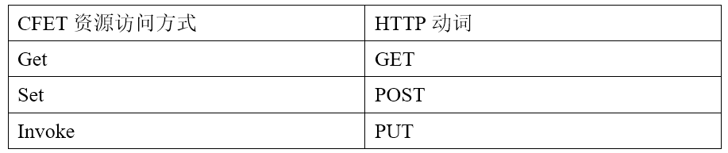
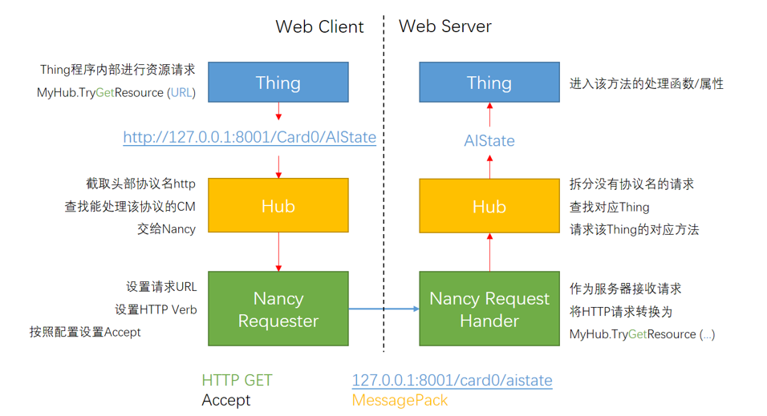
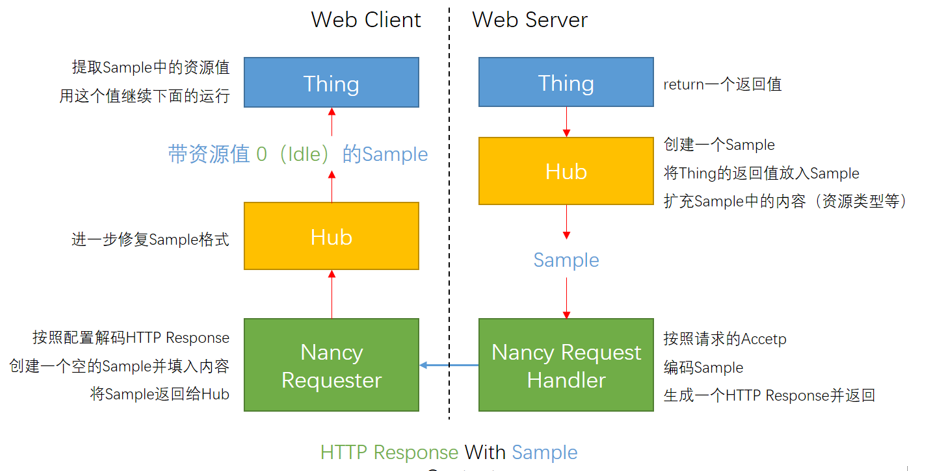
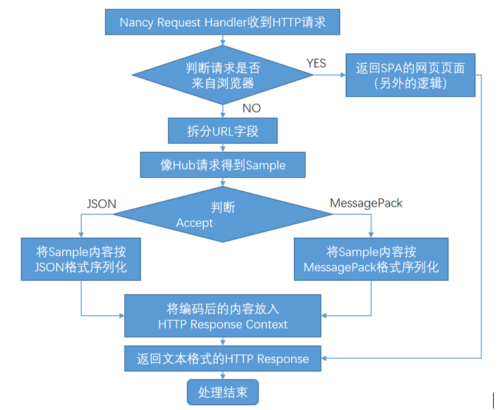

# NancyModule说明文档
## Conmmunication Module
在CFET中，Thing与其资源通过统一资源定位符（Uniform Resource Locator，简称URL）进行访问。在CFET Host内部的资源访问中，URL只包含所访问资源的路径和需要的参数。而如果需要访问网络中，也就是其它CFET Host中的资源时，则需要在URL的头部加上对应的协议，主机（或域名）与端口，如“http://192.168.0.1:8001”。当Hub发现了带协议的URL之后，就不会在自己内部寻找对应资源，而是将该资源交给实现了这一协议的Communication Module来处理。

## HTTP CM（Communication Module）
实现Http协议的CM就是HTTP CM。HTTP CM的实现使用了Nancy，Nancy是一个轻量化的HTTP服务软件包。所以NancyModule就是借由Nabct实现了HTTP协议的Communication Module。
HTTP CM主要功能包括Client与Server部分。
Client负责将Hub传递过来的资源访问请求，也就是资源路径+参数进行处理，转换为对应的HTTP请求发送到网络。
Server负责将接受到的HTTP请求进行拆解处理，将资源路径+参数复原后再交给自己的Hub。
Hub此时和内部请求一样，处理完成之后，将结果返回给Server，Server再将结果以Sample的格式打包成HTTP Response并返回给请求发起方。
HTTP是一种分段文本传输协议。在HTTP中有一个字段叫HTTP Verb（HTTP动词），对应不同的HTTP请求行为。
这里我们利用这一特征，将CEFT中不同的资源访问方式与HTTP动词结合起来。

需要注意其动作对应性，HTTP GET来访问并读取Status和Config，HTTP POST来设置Config，HTTP PUT来调用Method，否则将出现不符合设计原则的错误。
3. 访问格式
对于跨CFET Host访问需要用到统一资源定位符（URL）。而HTTP协议非常好地支持了这一特点，因为互联网上的任何资源访问正是通过URL来进行的。因此，通过URL和HTTP动词，我们可以很好地实现CFET不同资源的访问。比如，如下一条HTTP请求就可以用来访问之前提到的采集卡Thing的采集数据：
HTTP GET http://192.168.0.2:8001/Card0/LatestData?channel=1
其中的192.168.0.2:8001对应的就是资源所在的CFET Host的网络地址，而?Channel=1则是访问该资源需要的参数（也可以直接把参数放在path里而不是Query String中，这样更加符合RESTful规范）。在一条资源访问请求发出之后，该资源所在的CFET Host需要进行HTTP回复。之前抽象定义中消息的回复格式为Sample，因此，CFET Host需要将资源打包成Sample的形式，并交给HTTP CM从而返回给信息请求者。
HTTP请求过程如下图。目前CFET2 HUB中支持Get，Set，Invoke方法。需要注意的是，目前虽然HTTP请求头是可以自定义设置的，但不支持body的更改。

```c#
ISample status = MyHub.Get(url);
ISample config = MyHub.Set(url);
ISample method = MyHub.Invoke(url);
```



HTTP回复过程如下图


## HTTP请求处理与传输编码
除了Thing之外，网络中的其它应用程序也可以对CFET Host发起资源请求。其实，HTTP CM Server并不清楚请求的发起方是其它的CFET Host程序还是第三方应用，它的处理是无区别的。为了处理这一请求，Nancy Request Handler的逻辑是这样的：

图中将对请求的处理通过HTTP内容协商的方式被分为两大类。一类是来自浏览器的页面请求，这种HTTP请求的头部“Accept”字段中含有“text/html”内容。对这一类的请求，Nancy Request Handler会返回一组网页的静态文件，它是一套庞大的SPA（Single Page Application）前端程序。在返回这些静态文件之后，处理就结束了，剩下的逻辑交给前端程序继续处理。这一部分内容非常复杂，也较为独立，因此在这里不展开说明。但值得注意的是，由于使用了HTTP作为网络通信协议，使得CFET Host不仅能够处理资源的调用，还能够充当一台Web服务器，提供一整套基于Web的控制系统操作界面，这也充分显示出了这套框架的灵活性。
另一类非浏览器页面的请求，本质上是对实际某个Thing的资源的调用（可以理解为访问了一个Web API）。在Nancy Request Handler向Hub重新请求并得到执行返回结果后，需要使用某种序列化方式将程序中的各种格式的数据转化成文本（也就是字符串）格式进行传输。HTTP CM允许两种序列化编码的方式，一种是JSON格式，一种是MessagePack格式，编码方式的选择同样通过HTTP内容协商实现。
两种序列化方式并不影响用户的获取值之后的使用体验。当值为复杂变量时，我们提供了TryConvertTo的方法，它是Sample.ObjectVal提供的类型转换方法，可以将获取的值转换为用户想要的类型。
JSON格式是互联网中使用最为广泛的一种编码格式。它格式简单易懂，人类可读，跨平台能力非常强，因此是HTTP CM最先使用的也是默认的基础网络编码格式。但JSON的序列化速度较慢，编码后的文本内容体积大，导致在大规模数据请求时（比如某个高采样率采集通道的原始数据请求）的序列化延迟和网络传输延迟很大，性能不佳。因此HTTP CM还增加了第二种数据编码格式MessagePack。这是一种类似二进制的编码方式，编码速度快，编码后的文本内容体积小，但是可读性和跨平台性能相较JSON有不少差距。因此针对使用情况的不同，在发送HTTP请求前，应用程序需要设置HTTP请求的Accept-Encoding字段来选择调用其它CFET Host种的资源后返回数据的编码方式。而CFET Host在运行的初始化阶段，HTTP CM也会像配置Thing的InitObj参数一样，配置该Host发其请求时所使用的Accept。