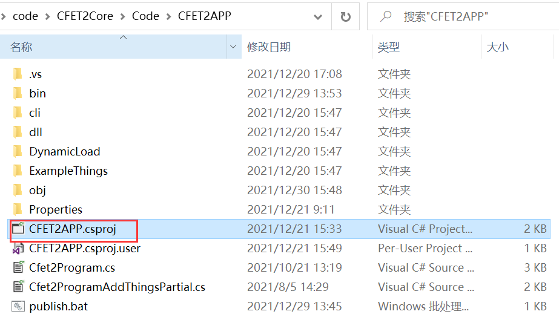
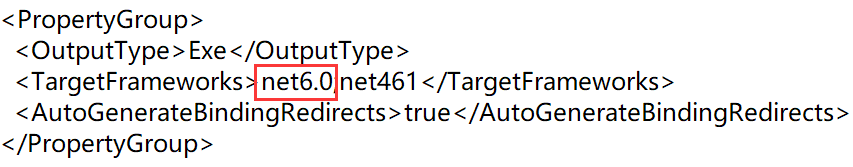
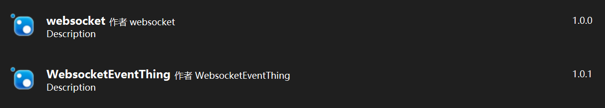

## cfetcore更新记录

将netcoreapp2.1升级到了net6.0

升级步骤:
1. 下载visual stuodio2022
2. 修改CFET2APP目标框架(直接在vs种修改也可以)

3. 重新编译运行即可

## publish
支持多平台需要发布项目

在sln文件或者csproj文件下执行即可生成发布文件夹，里面包含了所需的依赖

dotnet publish -f net6.0 -r linux-arm64 --configuration Release --no-self-contained

dotnet publish -f net6.0 -r linux-x64 --configuration Release --no-self-contained

其中需要注意的是System.IO.Ports不同框架对应不同dll，引用该类的一定记的publish的时候指定目标runtime和框架

## nuget包上传
更新了项目之后需要更新对应的nuget包，修改包的版本后双击AutoNuget.bat即可

nuget pack
for /f "delims=" %%a in ('dir /b/a-d/oN *.nupkg') do set n=%%a
nuget push %n% jushen -Source http://222.20.94.134:14999/api/v2/package
pause

## 改动
1. 将该项目下涉及到长时间运行的task都做了修改，指定了长时间运行的参数
Task.Factory.StartNew(() => serverLoop(), TaskCreationOptions.LongRunning);

2. 对远程事件进行了修改以及上传nuget包
要使用websocket记得要下两个nuget包
